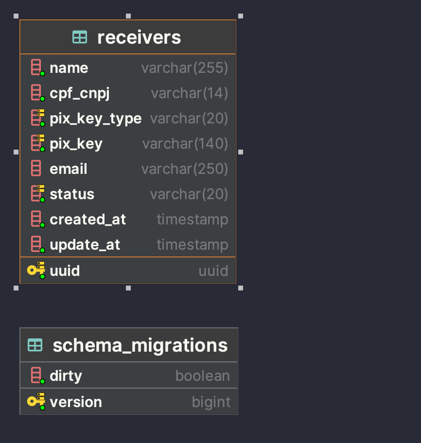
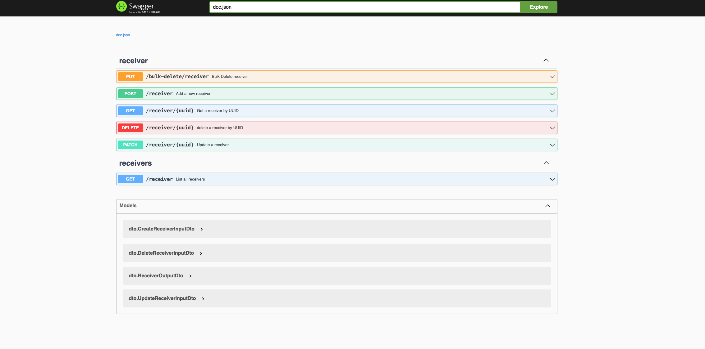

# Golang Transfer Api




##  Download Collection Postman
docs/collection.json

## Run

## Docker
docker is configured to up the database, create the tables, insert some records and running the api.
```bash
docker-compose up
```


## Running Development Env

## Requirements
- Docker
- Golang
- Make
- Migrate


Install Dependencias

```bash
  go mod tidy
```

Start Service

```bash
  make start
```


Running Tests

Or
```bash
make test
```
```bash
go test -v ./...
```

Swagger:
http://localhost:8080/swagger/index.html


